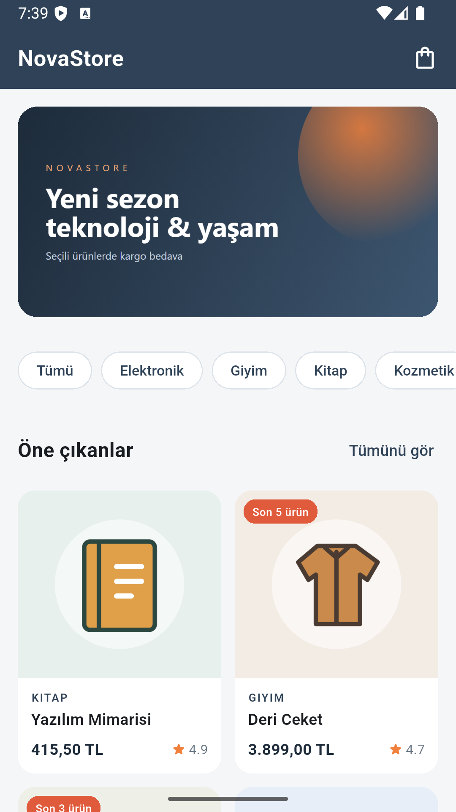
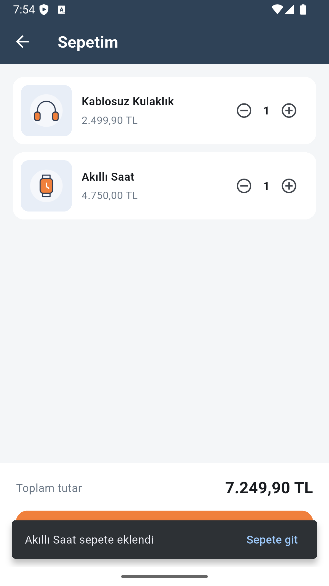
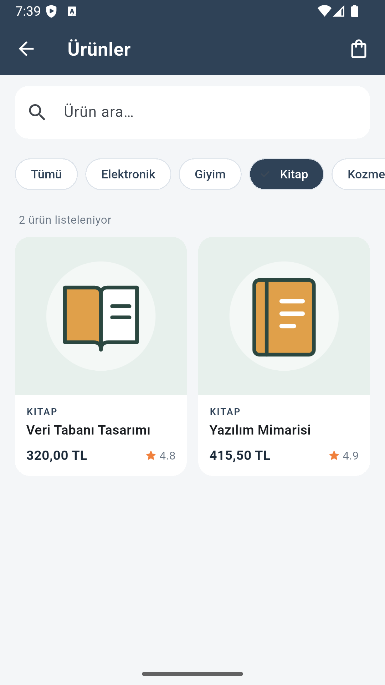

# NovaStore Mini Katalog

> Mobil Uygulama Geliştirme; Android / iOS — Flutter Bitirme Projesi
> **Hazırlayan:** Süleyman Hamurcu

## Kısa açıklama

**NovaStore Mini Katalog**, Flutter ile geliştirilmiş temel seviye bir mobil katalog
uygulamasıdır. Ürünler yerel bir JSON dosyasından okunur, kategoriye göre filtrelenir,
kart tabanlı bir ızgarada listelenir ve detay ekranında incelenir. Sepet akışı
simülasyon olarak çalışır.

Uygulama, eğitim kapsamı gereği **yalnızca `material.dart`** kullanır; `pubspec.yaml`
içinde hiçbir ek paket bağımlılığı yoktur.

## Ekran görüntüleri

| Ana Sayfa | Ürün Listesi | Ürün Detayı |
|---|---|---|
|  |  |  |

| Sepet | Kategori Filtresi |
|---|---|
|  |  |

Görüntüler Android emülatöründe (Pixel, 1080x1920) release derlemesinden alınmıştır.

## Ekranlar

| Ekran | İçerik |
|---|---|
| **Ana Sayfa** | Banner görseli, yatay kategori şeridi, öne çıkan ürünler (GridView) |
| **Ürün Listesi** | Arama alanı, kategori filtresi (ChoiceChip), sonuç sayacı, ürün kartları |
| **Ürün Detayı** | Büyük görsel, puan/stok rozeti, fiyat, açıklama, özellik tablosu, "Sepete ekle" |
| **Sepet** | Satır bazında adet artırma/azaltma, toplam tutar, sipariş tamamlama (simülasyon) |

## Kullanılan sürümler

| Bileşen | Sürüm |
|---|---|
| Flutter | **3.44.4** (stable) |
| Dart | 3.12.2 |
| Hedef platform | Android (test cihazı: Pixel emülatörü, Android SDK gphone64 x86_64) |

## Çalıştırma adımları

```bash
# 1) Projeyi indirin
git clone https://github.com/slmn-hmrc/nova-katalog.git
cd nova_katalog

# 2) Bağımlılıkları alın
flutter pub get

# 3) Bağlı cihazları listeleyin
flutter devices

# 4) Uygulamayı çalıştırın
flutter run
```

Emülatör kullanacaksanız önce emülatörü başlatın:

```bash
flutter emulators                      # kayıtlı emülatörleri listeler
flutter emulators --launch <emulator_id>
```

APK üretmek için:

```bash
flutter build apk --release
```

## Proje yapısı

```
nova_katalog/
├── lib/
│   ├── main.dart                       # MaterialApp, Named Routes, tema
│   ├── models/
│   │   └── product.dart                # Veri modeli — fromJson / toJson
│   ├── services/
│   │   ├── product_service.dart        # JSON asset okuma, filtreleme, arama
│   │   └── cart_service.dart           # Sepet simülasyonu (ValueNotifier)
│   ├── pages/
│   │   ├── home_page.dart              # Ana sayfa
│   │   ├── product_list_page.dart      # Ürün listesi
│   │   ├── product_detail_page.dart    # Ürün detayı
│   │   └── cart_page.dart              # Sepet
│   └── widgets/
│       ├── product_card.dart           # GridView ürün kartı
│       └── cart_button.dart            # Rozetli sepet butonu
├── assets/
│   ├── data/products.json              # 12 ürün, 5 kategori
│   └── images/                         # Ürün görselleri + banner
└── pubspec.yaml
```

## Yönerge çıktılarının karşılığı

| Yönerge çıktısı | Projedeki karşılığı |
|---|---|
| Çalışan Mini Katalog Uygulaması | `flutter run` ile emülatörde çalışır |
| Ana sayfa – ürün listesi – ürün detayı | `home_page` / `product_list_page` / `product_detail_page` |
| Sayfa geçişleri (Navigator) | `Navigator.pushNamed` ve `Navigator.pop` |
| Route Arguments kullanımı | `onGenerateRoute` içinde `settings.arguments` çözümlemesi |
| GridView ile kart tabanlı tasarım | `GridView.builder` + `ProductCard` |
| Basit state güncelleme | `setState` (arama/filtre) ve `ValueNotifier` (sepet) |
| Proje klasör yapısı | `models` / `services` / `pages` / `widgets` ayrımı |
| Asset yönetimi | `assets/data/products.json` + `assets/images/*.png` |

## Veri kaynağı hakkında

Katalog verisi ve ürün görselleri **eğitim ve demo amaçlıdır**; gerçek bir e-ticaret
altyapısını temsil etmez. Yönergedeki API kullanımı yerine, ek paket gerektirmemesi için
`rootBundle` ile okunan yerel bir JSON dosyası üzerinden aynı veri modelleme ve listeleme
mantığı uygulanmıştır.
